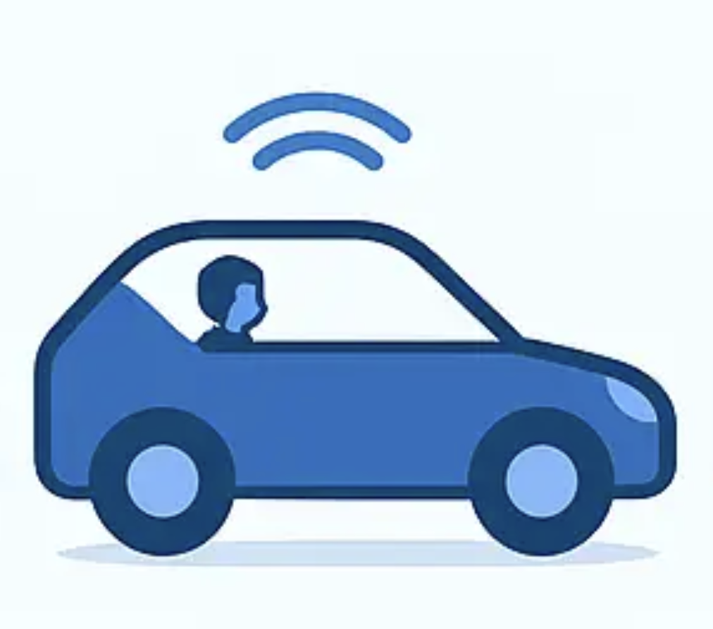
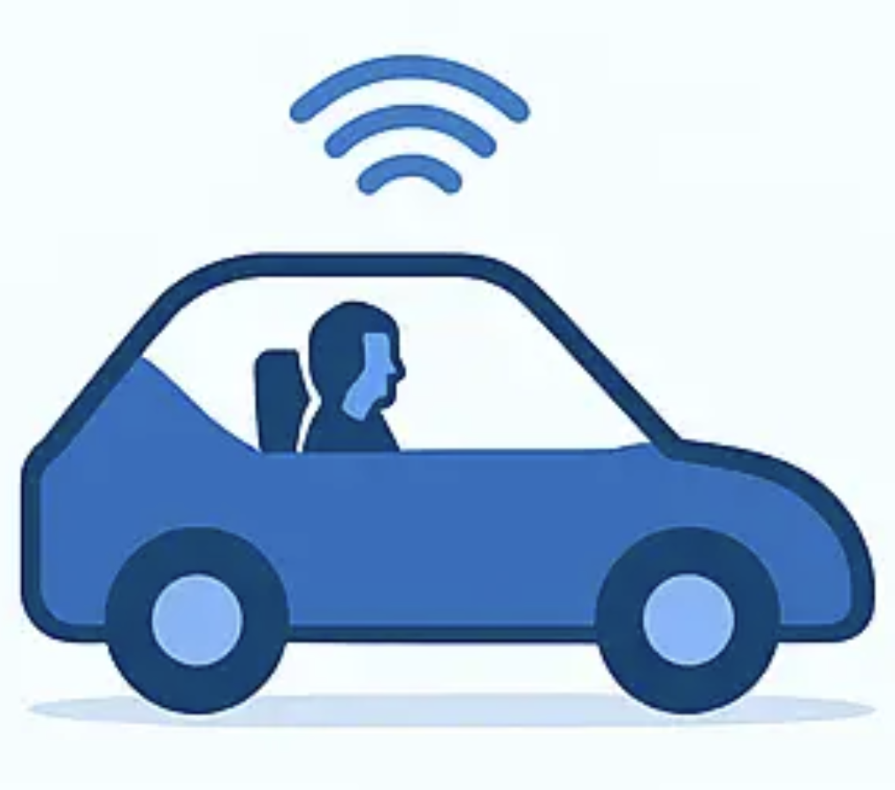
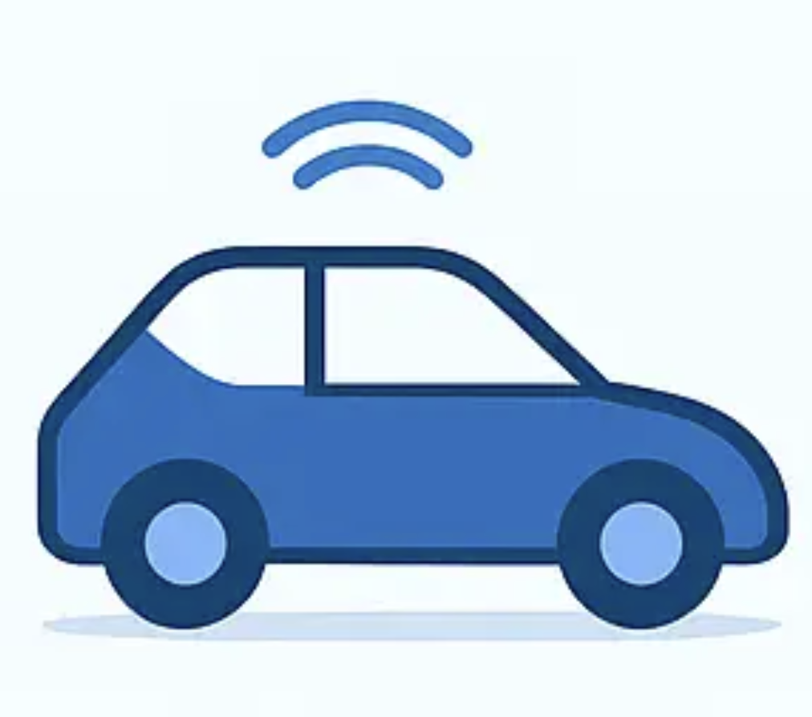
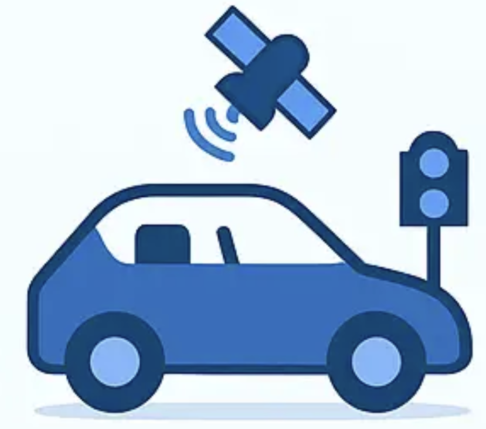

## VISUAL

## Levels? What are those?
There are six different levels of autonomous vehicles(AVs), ranging from level zero, where you are fully in control of your car, to level 5, where you have no control at all. Each level has many different elements you need to take into account when deciding on a car. For lawmakers and those interested in the legislations, see our final section. For those who are intent on purchasing a new vehicle, look at the examples, safety, and security concerns of each level detailed on their sub-page. 

 
(Anastasia, 2025)

### Level 0: Fully Human
At level 0, there is very little assistance. The car might provide warning or alerts, but you are in full control of the vehicle. Level 0 vehicles include vehicles without cruise control or any driver aids, making it rare to see a Level 0 vehicle on the road today.
[More info on Level 0](Level0/)

 
(Anastasia, 2025)

### Level 1: A Little Help
Level 1 is where we start to see the first implementations of driver aid facilities, and covers the most basic of applications. This is where most cars currently are at, and includes features such as standard cruise control, adaptive cruise control, lane keep assist, and emergency braking. The key restriction of this level is that the vehicle can control either acceleration and braking OR steering, but not both at the same time.
[More info on Level 1](Level1/)

 
(Anastasia, 2025)

### Level 2: We're Getting There
We start to see combinations of steering AND acceleration/braking control when we get to the Level 2. Here, you will see lane keep assist and adaptive cruise control combine to create roadtrip modes, which can keep you in your lane and maintain your speed. The vehicle will assist in your driving, but you are still in charge, and it is just helping guide you along the way. 
[More info on Level 2](Level2/)

 
(Anastasia, 2025)

### Level 3: Supervised Autonomous
Once we get to level 3, we switch the script around - now, in specific situations, the car can take control and you get bumped to a supervisory role. You are in charge of taking control of the vehicle when the system cannot keep up, but normal operating procedure is that the vehicle is in control. This can be seen in very recent cars, but is still rare to find.
[More info on Level 3](Level3/)

 
(Anastasia, 2025)

### Level 4: Autonomous-ish
In Level 4, the driverless system is in full control, and you don't have to pay attention. The vehicle will do everything, and most cars of this caliber have manual control as an afterthought, or add-on option. The main restriction to Level 4 vehicles in that they only can operate fully autonomously in certain areas. This makes them great as regional taxis and commuter cars, but still cannot drive themselves everywhere. We've recently started seeing examples of this, but they still are few and far between.
[More info on Level 4](Level4/)

 
(Anastasia, 2025)

### Level 5: Autonomous
Level 5 is the end goal. These vehicles are fully autonomous, 100% of the time. They don't need a human for anything, and can serve as a seamless tool for transportation. This is ideal as the car of the future, and is what people usually think of when they talk about a self-driving car. We don't currently have anything at this level, and most likely won't for a while still.
[More info on Level 5](Level5/)

## Current legislation
In the US, out of the 50 states and Washington DC, only 19 states permit autonomous vehicle use, and only 34 states have any legislation pertaining to Autonomous Vehicles at all(Autonomous Vehicle Statutes and Regulations Across the 50 States, 2024). For the states that permit autonomous vehicles, most require the autonomous vehicles to have a 'minimal risk condition' when the autonomous system fails. This means that the vehicles are required to have some way to safely get out of harms' way, and stop, when the system fails. There is little regulation on what specific levels these states are allowing, but generally Levels 4 and 5 are the systems that this legislation aims to control.

In Europe, they have comprehensive frameworks to regulate the development and usage of Autonomous Vehicles. Engineering teams are required to adhere to proper safety and performance standards, and legislation also regulates testing of the vehicles before production.

[Click here to learn more about the current legislation](Legislation/)
