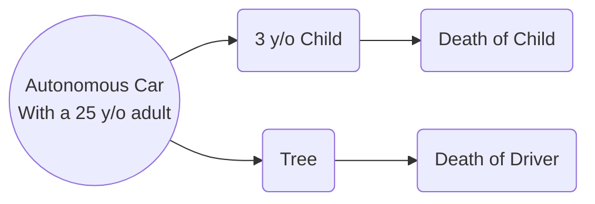
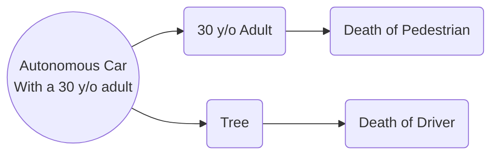
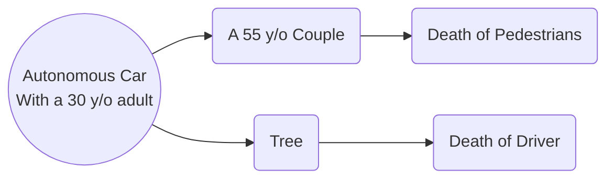
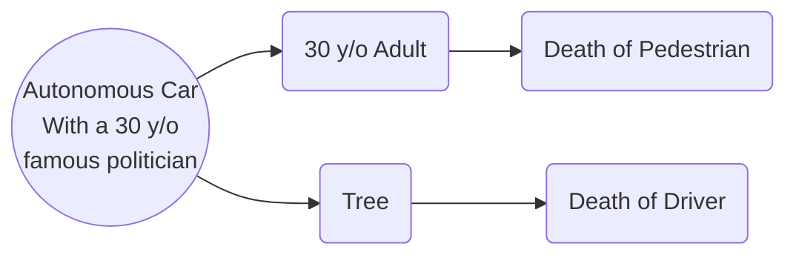
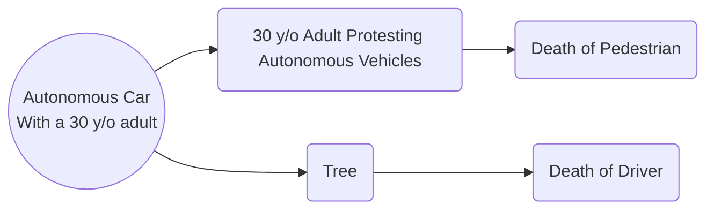

## Overview
Following are several different situations modeled after the trolley problem, but reconfigured for autonomous vehicle ethical dilemmas.

For each of the following scenarios, thin about the options and come up with a choice based off of at least two different ethical lenses. Discuss the scenario and your choices with your group-mates, and try to come up with your 'optimal' choice. As you do, consider the questions attached to each scenario to help guide your decisions.

## Scenario 1

Who do you save? Is there any claim that the driver is simply more important because they are the one that purchased the car? How would the different ethical lenses view this scenario?

## Scenario 2

In this scenario, the only difference is that the pedestrian did not make any decision to trust the car - only the driver did. Does that mean we should prioritize the person that didn't necessarily agree to autonomous vehicles? Or is the driver more important, because it is their car?

## Scenario 3

Do the ages matter? Similar to the last problem, how much is the driver's ownership of the car affecting your decisions?

## Scenario 4

How does the social status of the driver change things? Are they more important because of that? Should that matter?

## Scenario 5

Should the protester be given more priority, because it is clear they are against the autonomous vehicle that is making this decision? What if they placed themselves in the way to cause the car to crash? Should it matter what their views are? If someone doesn't sign up for an autonomous vehicle, should they still be susceptible to the vehicles decisions?

## Wrap Up
After considering the scenarios, what ethical lenses were the most useful? Which were the hardest scenarios to decide? Answer the following discussion questions with your peers. We hope our readers have learned something as a result of this case study, and will take note of the legislation on autonomous vehicles developing around us.

## Discussion Questions
1. How did this activity change your perception of autonomous vehicles?
2. Is it right that someone can get an autonomous vehicle that could make decisions to prioritize their life over everyone else's?
3. How does one person having an autonomous vehicle affect the life and safety of other drivers and pedestrians?
4. What levels of autonomous vehicles do you think should be allowed on roads?
5. What has your experience with autonomous vehicles been? How do you feel about taking the control of the car away from the humans?
6. Who should we blame when an autonomous vehicle, in the intermediate levels (2,3,4), has an accident? Is it the driver's fault, or the manufacturer's?
7. Do you think development on autonomous vehicle technology should be paused to allow for regulation to catch up? 
8. What could the process of getting an autonomous vehicle certified for road use look like?
9. Who should be in charge of regulating the autonomous vehicles? Experts in the field? Ethical experts? Politicians?

[HOME](../)
