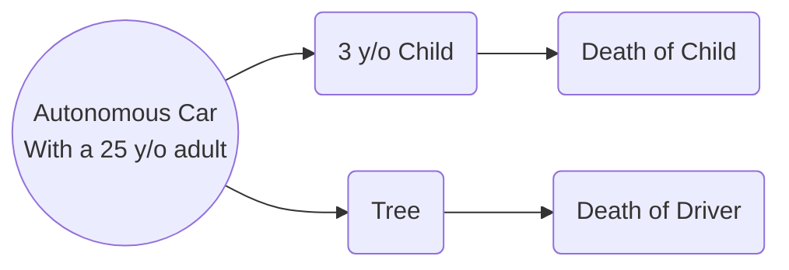
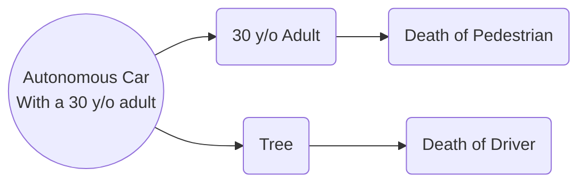

## Overview
Following are several different situations modeled after the trolley problem, but reconfigured for autonomous vehicle ethical dilemas.

For each of the following scenarios, thin about the options and come up with a choiced based off of at least two different ethical lenses. Discuss the scenario and your choices with your groupmates, and try to come up with your 'optimal' choice.

## Scenario 1

Who do you save? Is there any claim that the driver is simply more important because they are the one that purchased the car? How would the different ethical lenses view this scenario?

## Scenario 2

In this scenario, the only difference is that the pedestrian did not make any descision to trust the car - only the driver did. Does that mean we should prioritize the person that didn't necesarily agree to autonomous vehicles? Or is the driver more important, because it is their car?

## Scenario 3

## Discussion Questions
1. What levels of autonomous vehicles do you think should be allowed on reads?
2. What has your experience with autonomous vehicles been? How do you feel about taking the control of the car away from the humans?
3. Who should we blame when an autonomous vehicle, in the intermediate levels (2,3,4), has an accident? Is it the driver's fault, or the manufacturer's?
4. Do you think development on autonomous vehicle technology should be paused to allow for regulation to catch up? 
5. What could the process of getting an autonomous vehicle certified for road use look like?
6. Who should be in charge of regulating the autonomous vehicles? Experts in the field? Ethical experts? Politicians?