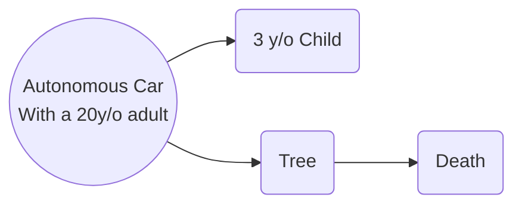

## Overview
Following are several different situations modeled after the trolley problem, but reconfigured for autonomous vehicle ethical dilemas.

For each of the following scenarios, thin about the options and come up with a choiced based off of at least two different ethical lenses. Discuss the scenario and your choices with your groupmates, and try to come up with your 'optimal' choice.

## Scenario 1

## Discussion Questions
1. What levels of autonomous vehicles do you think should be allowed on reads?
2. What has your experience with autonomous vehicles been? How do you feel about taking the control of the car away from the humans?
3. Who should we blame when an autonomous vehicle, in the intermediate levels (2,3,4), has an accident? Is it the driver's fault, or the manufacturer's?
4. Do you think development on autonomous vehicle technology should be paused to allow for regulation to catch up? 
5. What could the process of getting an autonomous vehicle certified for road use look like?
6. 